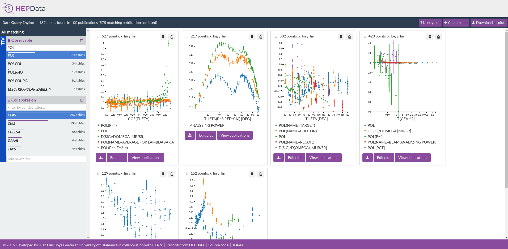
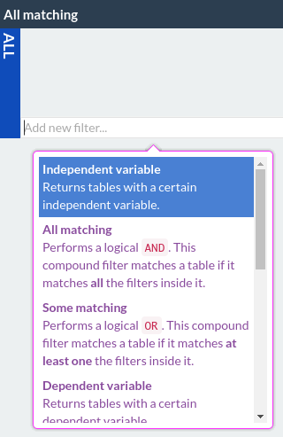
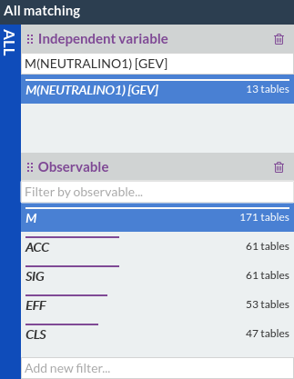
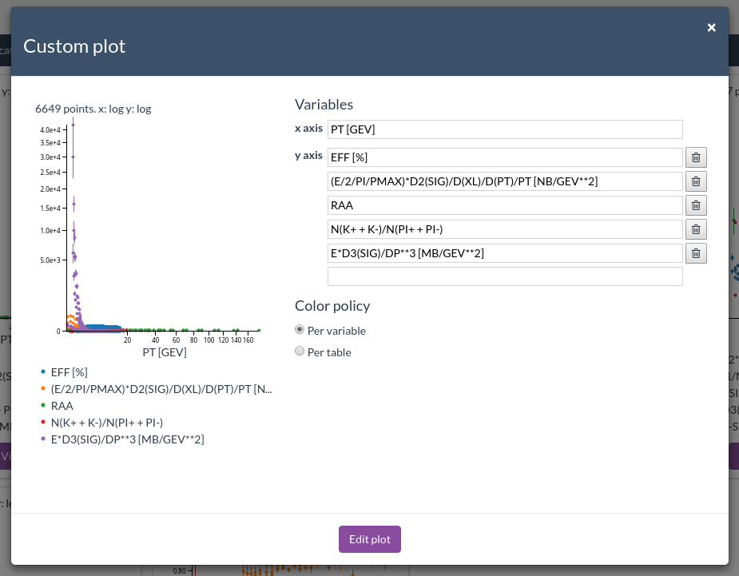
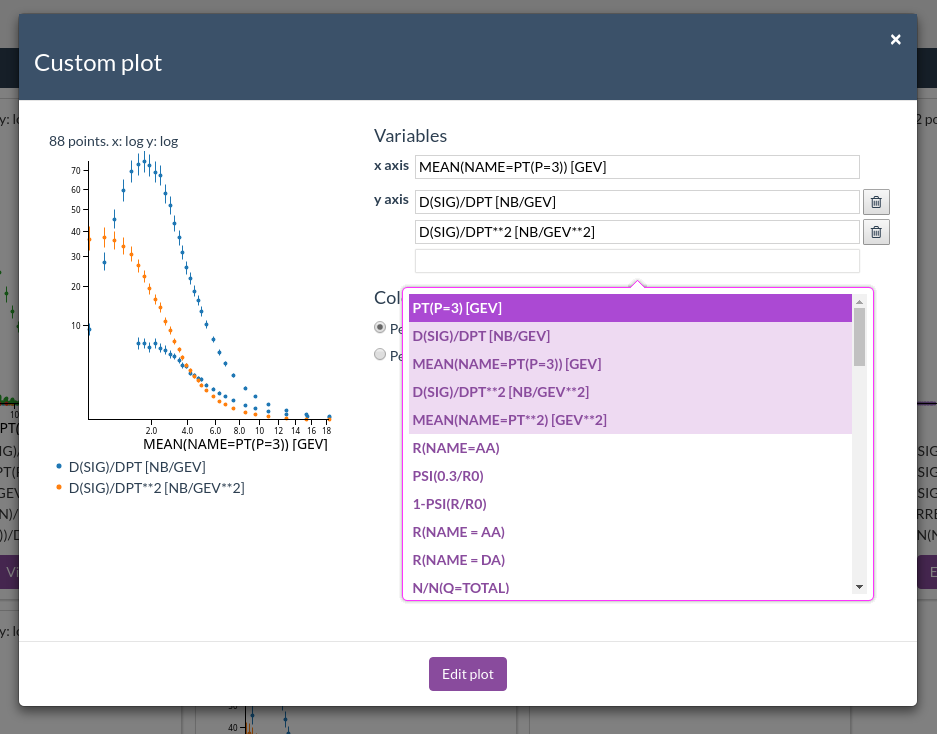
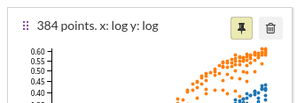
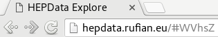

HEPData Explore User Guide
==========================

[HEPData Explore](http://hepdata.rufian.eu/) is a data retrieval and visualization tool for high energy physics.

Data tables from scholarly publishing recorded in [HEPData.net](http://hepdata.net) are fed into an index that makes it possible to retrieve subsets according to user defined criteria and visualize them in the application.

HEPData Explore can put together several tables in a same plot — even if they belong to different publications, as long as they share a pair of variables.

##Filtering

Filtering criteria is defined in the left panel.

Filters are defined recursively. They can be leaf filters that match attributes of the tables or compound filters, that combine several other filters in order to perform boolean operations and allow the definition of more complex criteria.

There is a root filter, which is always a compound filter. You can use its *Add new filter* text box at the bottom to add new child filters inside it.

###Filter granularity

**Filter are always applied with table granularity.** Entire tables are matched, not just columns.

This means, for instance, that adding a dependent variable filter will return all tables having that variable, but the rest of variables from that table will still be retrieved, plotted and can be referred in other filters.

As an example, if you wanted to retrieve tables having two specific dependent variables you would combine two *Dependent variable* filters within a compound *All filter*.

###Supported filters

Currently HEPData Explore supports the following filters:

**Compound filters:**

* All matching (`AND` filter)
* Some matching (`OR` filter)

**Leaf filters:**

* Independent variable
* Dependent variable
* Collaboration
* Reaction
* Observable
* Phrase
* Center of mass energy

###Contextual suggestions

Many filters feature suggestions. These suggestions take into account the state of the rest of filters in the tree. Only values that would match results should they be chosen will show up.

##Automatic plots

Each time the filters are modified, matching tables are retrieved and an algorithm is run in order to create plots from the data.

The algorithm is stateful: the resulting plot set is a function of the currently matched data and the immediately previous plot set.

The algorithm tries to refine existing plots to the extent possible rather than tearing all of them down and creating a new plot set from scratch.

##Custom plots

You can further modify the plots in order to visualize a custom set  of variables. You can do that by using the *Edit plot* buttons or you can create new plots from scratch using the *Custom plot* button.

You can use the provided text boxes to edit any of the variables plotted. You can also delete the text of a variable or click the trash button to remove some of them, or use the last text field to add new ones.

Each text field features autocompletion of variables. Both independent and dependent variables can be used for both axes.

Suggestions highlighted in light purple are *cross matches*. For instance, if you are adding y variables, those variables that share data rows with the currently selected x variable will be highlighted. Non highlighted variables would only show data if the x axis variable were edited.

y variables are highlighted if they share any data rows with *the currently selected* x variable.

x variables are highlighted if they share any data rows with *any of the currently selected* y variables.

Changes made to the plot need to be confirmed with the *Edit plot* button in order to be saved in the view.

##Pinned plots

Pinned plots are never modified or removed by auto plots algorithm. You can pin and unpin them using the thumbtack button.

Manually created or edited plots are pinned automatically to prevent accidental loss.

##Shareable URLs

Each time a search is completed or plots are edited, the URL in your browser will be updated.

You can copy and paste the URL to share your search with others. They will view exactly the same plots with the same filters set.

You can also use your browser bookmarks to save searches for later.

##Undo and redo

Each interaction, in addition to creating a new shareable URLs, also creates a history entry in your browser. This means you can use your browser *Back* and *Forward* buttons to undo and redo actions respectively.

##Publication list and data download

HEPData Explore also lets you view the list of tables and publications that make up a plot with the *View publications button*.

On the other hand, the *Download* button creates a file in your computer with this same list list of tables and publications and also includes the data from the plot.

This file is in a both machine and human-readable format ([YAML](http://yaml.org/)) and is meant to be processed with a programming language (e.g. Python).

The *Download all plots* button works similarly but includes data from all the visualized plots in a single file.